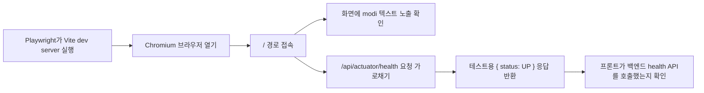

# Playwright E2E 테스트 가이드

## 왜 Playwright를 쓰는가

Playwright는 실제 브라우저를 실행해서 사용자가 보는 화면과 상호작용을 검증하는 E2E 테스트 도구다. JUnit이 백엔드 메서드와 API 로직을 검증하고 JaCoCo가 코드 커버리지를 보여준다면, Playwright는 프론트 화면에서 사용자가 기대하는 흐름이 실제로 동작하는지 확인한다.

이 프로젝트에서는 다음 역할로 시작한다.

| 구분 | 도구 | 목적 |
| --- | --- | --- |
| 백엔드 단위/통합 테스트 | JUnit | API와 서버 로직이 맞는지 검증 |
| 백엔드 커버리지 | JaCoCo | 테스트가 실제 코드를 얼마나 지나갔는지 측정 |
| 프론트 E2E | Playwright | 실제 브라우저에서 화면과 사용자 흐름 검증 |
| API/성능/부하 | k6 | 백엔드 API가 트래픽을 버티는지 측정 |

## 현재 설정

추가된 주요 파일은 다음과 같다.

| 파일 | 역할 |
| --- | --- |
| `playwright.config.js` | 테스트 위치, 브라우저, Vite dev server 자동 실행 설정 |
| `tests/e2e/modi-smoke.spec.js` | 첫 smoke E2E 테스트 |
| `.github/workflows/e2e.yml` | PR마다 E2E 테스트를 실행하는 GitHub Actions |

현재는 가장 가벼운 시작점으로 Chromium 하나만 실행한다. 팀이 익숙해지면 Firefox, WebKit, 모바일 뷰포트를 추가할 수 있다.

## 실행 방법

처음 한 번만 Playwright 브라우저를 설치한다.

```bash
npx playwright install chromium
```

E2E 테스트를 실행한다.

```bash
npm run test:e2e
```

브라우저를 보면서 테스트를 만들고 싶을 때는 UI 모드를 사용한다.

```bash
npm run test:e2e:ui
```

실패 리포트나 실행 결과 HTML을 다시 보고 싶을 때는 다음 명령을 사용한다.

```bash
npm run test:e2e:report
```

## 첫 테스트가 검증하는 것

`tests/e2e/modi-smoke.spec.js`는 다음 흐름을 검증한다.



여기서 API를 실제 서버로 보내지 않고 Playwright가 목킹하는 이유는 테스트 안정성 때문이다. E2E 테스트의 첫 단계에서는 프론트 코드가 올바른 API를 호출하는지와 화면이 깨지지 않는지를 검증하고, 실제 배포 서버 연결 검증은 별도 스모크 테스트나 k6 테스트에서 다루는 편이 좋다.

## 테스트 작성 패턴

기본 구조는 다음과 같다.

```js
import { expect, test } from "@playwright/test";

test("사용자가 볼 수 있는 동작을 검증한다", async ({ page }) => {
  await page.goto("/");

  await expect(page.getByText("modi")).toBeVisible();
});
```

API 응답을 고정해서 UI 상태를 검증할 때는 `page.route`를 사용한다.

```js
await page.route("**/api/example", async (route) => {
  await route.fulfill({
    status: 200,
    contentType: "application/json",
    body: JSON.stringify({ result: "ok" }),
  });
});
```

## 앞으로 늘릴 테스트 후보

프론트 기능이 늘어나면 다음 순서로 E2E 테스트를 추가하는 것이 좋다.

1. 홈 화면이 정상 렌더링되는지
2. 로그인 화면 진입과 실패 메시지가 정상 동작하는지
3. 로그인 성공 후 메인 화면으로 이동하는지
4. 주요 목록 조회 API 응답에 따라 화면이 바뀌는지
5. 등록/수정/삭제 같은 핵심 사용자 액션이 정상 동작하는지
6. API 실패, 빈 데이터, 로딩 상태가 깨지지 않는지

## 팀 운영 기준

처음부터 모든 화면을 E2E로 덮으려고 하면 유지보수 비용이 커진다. 우선 팀 프로젝트 발표와 안정성 어필에 도움이 되는 핵심 흐름만 자동화하는 것이 좋다.

권장 기준은 다음과 같다.

| 단계 | 기준 |
| --- | --- |
| 1단계 | smoke test 1개로 Playwright 실행 흐름 검증 |
| 2단계 | 로그인/핵심 페이지 이동 1개 추가 |
| 3단계 | API 성공/실패 케이스 목킹 |
| 4단계 | GitHub Actions에서 PR마다 자동 실행 |
| 5단계 | k6로 백엔드 API 성능 테스트 분리 |

## Node 버전 주의

현재 의존성 일부는 Node `^20.19.0 || ^22.13.0 || >=24`를 권장한다. 로컬 Node가 이보다 낮으면 설치는 되더라도 `EBADENGINE` 경고가 나올 수 있다. 팀 공통 개발 환경은 Node 22.13 이상 또는 24 이상으로 맞추는 것을 권장한다.

## 참고 자료

- [Playwright 공식 문서](https://playwright.dev/docs/intro)
- [Playwright Trace Viewer](https://playwright.dev/docs/trace-viewer)
- [Playwright CI 설정](https://playwright.dev/docs/ci)
- [k6 browser 공식 문서](https://grafana.com/docs/k6/latest/using-k6-browser/)
